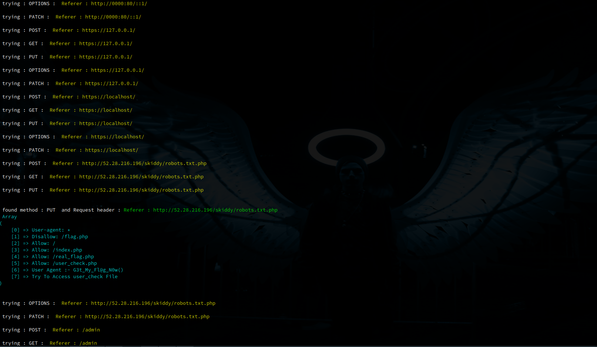

# bypass-403-php
# by : omar alahmadi

How to use it ? 

installation
```bash
git clone https://github.com/keenv1/bypass-403-php.git && cd bypass-403-php
```
requarment
```bash
sudo apt install php php-curl
```
start up 
```bash
sudo chmod +x bypass-403-php
```
```bash
php bypass-403-php 
```

